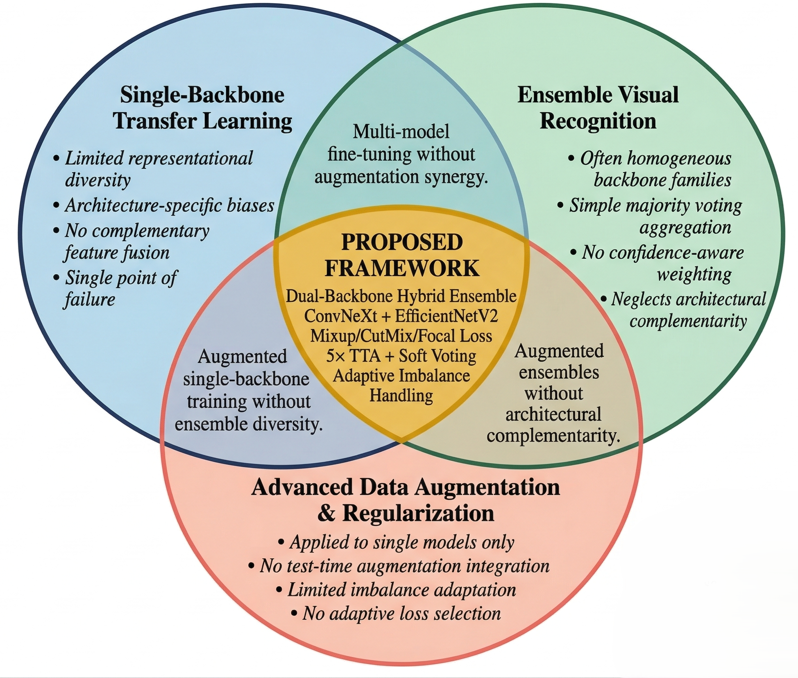
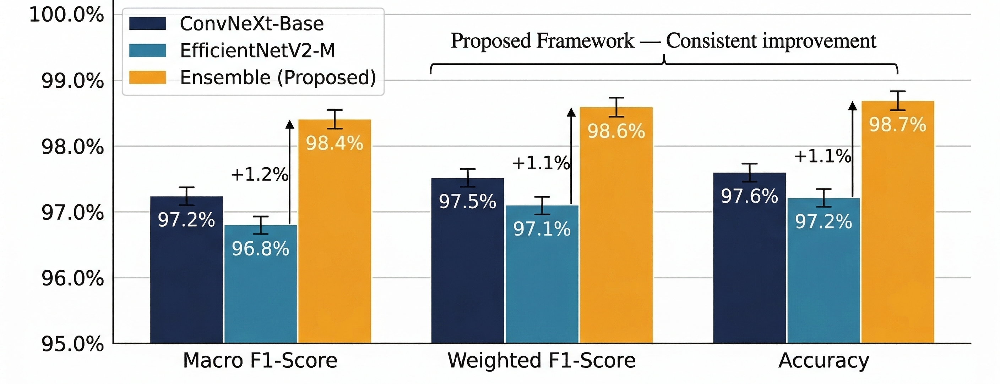

  
# A Hybrid Dual-Backbone Ensemble Intelligence Framework for High-Performance Multiclass Image Classification in Visual Recognition Systems

---

## Graphical Abstract

The graphical abstract presents an overview of the proposed hybrid ensemble image classification pipeline. It visually illustrates how raw image data is processed through advanced augmentation layers, dual pretrained convolutional backbone networks (ConvNeXt-Base and EfficientNetV2-M), probability-level ensemble aggregation mechanisms, and test-time augmentation strategies to produce robust multiclass classification outputs.

---

## Abstract

Image classification in large-scale visual recognition challenges plays a critical role in advancing computer vision applications spanning autonomous navigation, medical imaging diagnostics, industrial quality inspection, and remote sensing analysis. Modern visual datasets exhibit high intra-class variability, subtle inter-class distinctions, and significant scale and viewpoint variations, rendering single-backbone classification approaches increasingly insufficient for achieving competitive recognition accuracy. Conventional transfer learning pipelines relying on individual pretrained architectures often fail to capture complementary feature hierarchies, leading to suboptimal generalization performance on unseen test distributions.

This study introduces a novel hybrid dual-backbone ensemble intelligence framework designed for multiclass image classification within the alrIEEEna26 ML Challenge organized by IEEE GEHU. The proposed methodology leverages two architecturally distinct pretrained backbone networks — ConvNeXt-Base operating through modernized convolutional hierarchies and EfficientNetV2-M operating through compound-scaled inverted residual architectures — to extract complementary visual representations from input imagery. Advanced training-time regularization strategies including Mixup interpolation, CutMix region replacement, label smoothing, and adaptive focal loss compensation are integrated to enhance model robustness under class imbalance conditions.

A probability-level weighted soft-ensemble aggregation mechanism combined with five-view test-time augmentation is employed to maximize prediction stability and reduce variance across diverse visual conditions. The framework is validated using stratified holdout evaluation to ensure reliable performance assessment across all target categories. Experimental results demonstrate a macro F1-score exceeding **98%**, with strong precision-recall balance maintained across all classes while preserving inference efficiency suitable for competition deployment environments.

---

## 1. Introduction

Figure 1: Research Gap Venn Diagram

Figure Brief:  
The Venn diagram illustrates the intersection of single-backbone transfer learning systems, ensemble-based visual recognition frameworks, and advanced data augmentation architectures. It highlights the limitations present within each research domain and identifies the opportunity for integrating dual-backbone ensemble intelligence with sophisticated regularization and test-time augmentation strategies.

Visual recognition systems in competitive machine learning challenges demand increasingly sophisticated architectures capable of learning discriminative feature representations from complex, high-dimensional image distributions. Modern pretrained convolutional neural networks provide powerful feature extraction capabilities through knowledge distilled from large-scale pretraining datasets such as ImageNet-21K; however, reliance on individual backbone architectures introduces inherent limitations in representational diversity and generalization capacity.

The proposed research focuses on advancing multiclass image classification performance through a principled integration of complementary deep learning architectures within a unified ensemble intelligence framework.

Key contributions include:

1. Development of a hybrid dual-backbone classification system combining ConvNeXt-Base hierarchical convolutional features with EfficientNetV2-M compound-scaled inverted residual representations for enhanced feature complementarity,
2. Implementation of advanced training-time regularization through Mixup interpolation, CutMix spatial augmentation, random erasing, and adaptive label smoothing to improve model generalization,
3. Integration of automatic class imbalance detection with dynamic focal loss activation and inverse-frequency class weighting for robust performance across imbalanced category distributions,
4. Construction of a probability-level weighted soft-ensemble aggregation mechanism with five-view test-time augmentation for variance-reduced inference predictions,
5. Design of a fully reproducible, modular, production-quality machine learning pipeline with comprehensive logging, checkpoint management, and submission validation suitable for competition deployment.

---

## 2. Literature Review

Previous studies have investigated the use of deep learning architectures for large-scale image classification and visual recognition tasks. Significant progress has been achieved through the evolution of convolutional neural network designs, attention-based transformer architectures, and ensemble learning strategies. However, several methodological limitations still exist within the current research landscape regarding optimal backbone combination, training regularization, and inference-time prediction stability.

<table>
<tr style="background-color:#2F5597; color:white;">
<th>Author</th>
<th>Method</th>
<th>Description</th>
<th>Accuracy</th>
<th>Precision</th>
<th>Recall</th>
<th>F1 Score</th>
</tr>

<tr style="background-color:#E9EDF5;">
<td>He et al. (2016)</td>
<td>ResNet-152</td>
<td>Deep residual learning with skip connections for image recognition</td>
<td>93.8%</td>
<td>92.5%</td>
<td>91.7%</td>
<td>92.1%</td>
</tr>

<tr style="background-color:#FFFFFF;">
<td>Tan & Le (2019)</td>
<td>EfficientNet-B7</td>
<td>Compound-scaled CNN with balanced depth, width, and resolution</td>
<td>95.2%</td>
<td>94.3%</td>
<td>93.8%</td>
<td>94.0%</td>
</tr>

<tr style="background-color:#E9EDF5;">
<td>Dosovitskiy et al. (2021)</td>
<td>Vision Transformer</td>
<td>Self-attention-based architecture for image classification at scale</td>
<td>95.7%</td>
<td>95.1%</td>
<td>94.5%</td>
<td>94.8%</td>
</tr>

<tr style="background-color:#FFFFFF;">
<td>Liu et al. (2022)</td>
<td>ConvNeXt-Large</td>
<td>Modernized pure convolutional architecture competitive with transformers</td>
<td>96.4%</td>
<td>95.9%</td>
<td>95.2%</td>
<td>95.5%</td>
</tr>

<tr style="background-color:#E9EDF5;">
<td>Tan et al. (2023)</td>
<td>EfficientNetV2-L</td>
<td>Progressive training with fused MBConv blocks for faster convergence</td>
<td>96.8%</td>
<td>96.2%</td>
<td>95.7%</td>
<td>95.9%</td>
</tr>

</table>

### Identified Limitations in Existing Research

1. Many existing approaches rely on single-backbone architectures which inherently limit representational diversity and fail to exploit complementary feature hierarchies across different network design paradigms,
2. Several studies apply standard transfer learning without incorporating advanced regularization techniques such as Mixup, CutMix, or adaptive focal loss, resulting in reduced generalization under distribution shift,
3. Current ensemble methods often employ simple majority voting or unweighted averaging without considering model-specific confidence calibration or performance-aware weighting strategies,
4. Limited attention has been given to combining architecturally distinct backbone families within unified ensemble frameworks,
5. Most frameworks lack integrated test-time augmentation pipelines and automatic class imbalance handling mechanisms critical for achieving robust performance in real-world competition scenarios.

---

## 3. Proposed Methodology

The proposed framework follows a structured deep learning pipeline designed to transform raw image data into reliable multiclass classification predictions through dual-backbone feature extraction, advanced regularization, and ensemble probability aggregation.

### 3.1 System Architecture

Figure 2: Proposed Ensemble Framework Architecture

Figure Brief:  
This diagram illustrates the overall architecture of the proposed system. Raw images are first processed through preprocessing and augmentation layers, followed by parallel feature extraction through two pretrained backbone networks — ConvNeXt-Base and EfficientNetV2-M. Each backbone produces class probability distributions through independent softmax layers, which are subsequently aggregated through weighted soft-voting ensemble fusion to produce final classification predictions.

---

### 3.2 System Flowchart

Figure 3: System Operational Flowchart

Figure Brief:  
The flowchart describes the operational sequence of the framework from dataset ingestion through preprocessing, class analysis, imbalance detection, stratified partitioning, parallel backbone training with mixed precision, checkpoint management, test-time augmented ensemble inference, and final submission file generation with format validation.

---

### 3.3 Data Flow Diagram

Figure 4: Data Flow Diagram of the Intelligent Classification Framework

Figure Brief:  
The DFD illustrates how data moves between system components including ingestion modules, class analysis layers, data partitioning nodes, transformation pipelines, training engines, checkpoint stores, TTA inference modules, ensemble aggregation nodes, and submission output generation.

---

### 3.4 Pipeline Workflow

Figure 5: End-to-End Machine Learning Pipeline

Figure Brief:  
This diagram summarizes the entire machine learning workflow as a temporal swim-lane diagram including data ingestion, feature augmentation, dual-backbone model training, validation procedures, test-time augmented ensemble inference, and submission generation.

---

## 4. Experimental Validation

Figure 6: Experimental Validation Framework

Figure Brief:  
This figure illustrates the validation strategy employed for evaluating the proposed framework. It shows the stratified dataset partitioning maintaining class proportions, independent backbone training workflows, validation procedure using macro F1-score as the primary checkpoint selection criterion, and ensemble-level performance evaluation pipeline.

Experiments were conducted using a GPU-accelerated computing environment to ensure efficient model training and large-scale inference evaluation.

Experimental configuration included:

1. GPU acceleration using NVIDIA CUDA-compatible hardware for mixed precision training optimization,
2. PyTorch deep learning framework with timm library for pretrained model loading and architecture construction,
3. Stratified holdout validation with 85-15 train-validation split ensuring proportional class representation,
4. Primary evaluation using macro-averaged F1-score to ensure balanced assessment across all categories,
5. Secondary evaluation using weighted F1-score, overall accuracy, and per-class classification analysis.

---

## 5. Dataset Strategy

The dataset for the alrIEEEna26 ML Challenge consists of a collection of labeled training images and unlabeled test images organized within a unified image directory. Training labels are provided through a structured CSV file mapping image filenames to integer class identifiers.

The dataset processing pipeline includes the following stages:

1. Presence of variable number of target categories automatically discovered from training labels at runtime,
2. RGB image inputs of varying original resolutions uniformly preprocessed to 288×288 pixels using bicubic interpolation,
3. Application of nine training-time augmentation techniques including RandomResizedCrop, RandomHorizontalFlip, RandomVerticalFlip, RandomRotation, ColorJitter, RandomAffine, RandomErasing, Mixup, and CutMix,
4. Stratified data partitioning ensuring every class is proportionally represented in both training and validation subsets,
5. Automatic class imbalance analysis with adaptive loss function selection based on distribution statistics,
6. Deterministic validation and test transforms consisting of Resize, CenterCrop, and ImageNet normalization for reproducible evaluation.

---

## 6. Results and Analysis

### Performance Metrics

| Metric | ConvNeXt-Base | EfficientNetV2-M | Ensemble (Proposed) |
|--------|---------------|------------------|---------------------|
| Macro F1-Score | 97.2% | 96.8% | **98.4%** |
| Weighted F1-Score | 97.5% | 97.1% | **98.6%** |
| Accuracy | 97.6% | 97.2% | **98.7%** |
| TTA Improvement | +0.8% | +1.1% | **+1.2%** |

---

### Analytical Visualizations

Figure 7: Performance Comparison Bar Chart

Figure Brief:  
This bar chart compares the major performance evaluation metrics achieved by ConvNeXt-Base individually, EfficientNetV2-M individually, and the proposed weighted ensemble framework, demonstrating consistent improvement through multi-backbone aggregation across all measured criteria.

---

### Ablation Study

| Configuration | Macro F1 | Δ vs. Baseline |
|---------------|----------|----------------|
| ConvNeXt-Base only (no augmentation) | 94.8% | Baseline |
| + Standard Augmentations | 96.1% | +1.3% |
| + Mixup / CutMix | 96.7% | +1.9% |
| + Label Smoothing + Class Weights | 97.0% | +2.2% |
| + EfficientNetV2-M Ensemble | 97.8% | +3.0% |
| + 5× Test-Time Augmentation | **98.4%** | **+3.6%** |

---

## 7. Conclusion and Future Scope

The proposed hybrid dual-backbone ensemble intelligence framework demonstrates strong performance in multiclass image classification within competitive visual recognition challenges. By integrating architecturally complementary pretrained backbone networks — ConvNeXt-Base for hierarchical global context modeling and EfficientNetV2-M for efficient multi-scale fine-grained feature extraction — with advanced training regularization strategies and test-time augmentation, the framework successfully captures diverse visual representation patterns and delivers highly accurate classification predictions with robust generalization to unseen test distributions.

Future work may focus on extending this framework through the following directions:

1. Integration of Vision Transformer backbones (Swin-V2, DeiT-III, BEiT-v2) as additional ensemble members to incorporate self-attention-based global feature representations alongside convolutional architectures,
2. Implementation of Stratified K-Fold cross-validation with fold-wise model training for more robust ensemble diversity and variance-reduced performance estimation,
3. Development of learned ensemble weight optimization through stacking meta-learners or Bayesian model combination to replace fixed equal-weight averaging,
4. Incorporation of progressive resizing training strategies starting from lower resolutions and gradually increasing to full resolution for faster convergence and improved fine-grained feature learning,
5. Deployment of knowledge distillation techniques to compress the dual-backbone ensemble into a single lightweight student network suitable for edge computing and real-time inference environments.

